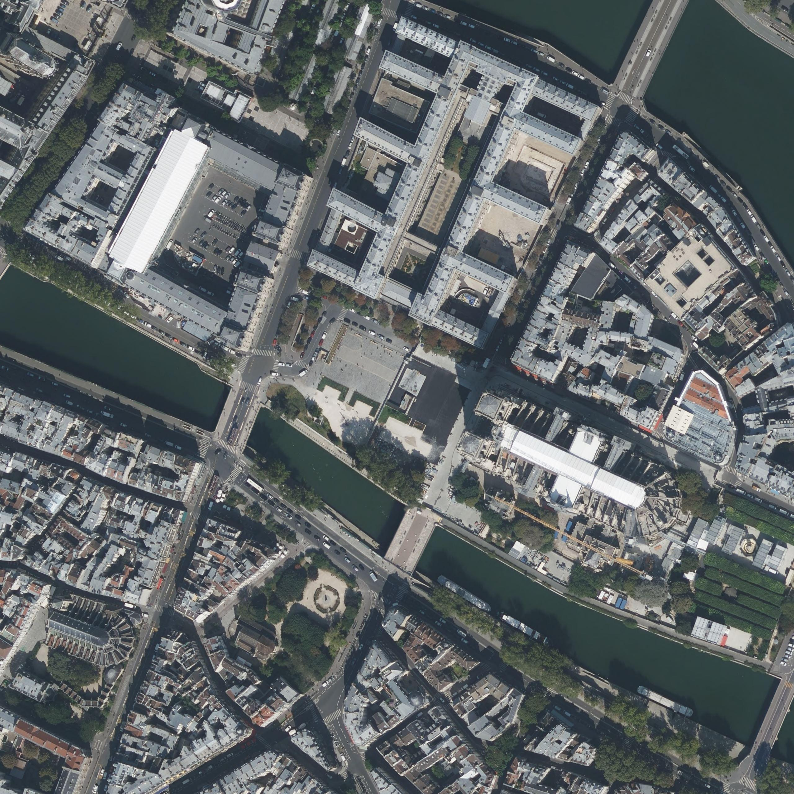

  <h1>Sky2Ground: A Benchmark for Site Modeling under Varying Altitude</h1>

  

    <b>Zengyan Wang</b>, 
    <b>Sirshapan Mitra</b>, 
    <a href="https://rajatmodi62.github.io/2026/04/09/sky2ground/"><b>Rajat Modi</b></a>, 
    <b>Grace Lim</b>,
    <b>Yogesh Rawat</b>
     
    <strong>CVPR 2026</strong>
     
    <a href="https://arxiv.org/abs/2603.13740">[arXiv]</a> | 
    <a href="https://www.kaggle.com/datasets/zhyw86/varying-altitude-dataset">[Dataset]</a> | 
    <a href="https://github.com/zhyw86/Sky2Ground">[Code]</a>
  

  

  <h2>🖼 Dataset Preview</h2>
  
Our dataset bridges the gap between synthetic environments and real-world captures. Below are samples of the multi-view perspectives provided.

  <h3>🌐 Synthetic Dataset (GIF Samples)</h3>
  
<i>Generated environments featuring a full 5-view suite.</i>

  

    
    
    
    
    
     
    <em>Satellite | Aerial L | Aerial C | Aerial R | Street View</em>
  

  

  <h3>📸 Real-World Dataset (Static Images)</h3>
  
<i>Authentic captures for domain validation.</i>

    
    
    
     
    
    
    
     
    <em>Top: Satellite & Aerial Views | Bottom: Street Views</em>
  

  <blockquote style="background: #f9f9f9; border-left: 10px solid #ccc; margin: 1.5em 10px; padding: 0.5em 10px; text-align: left;">
    <strong>Note:</strong> Real-world samples are provided as high-resolution static images, while synthetic samples include dynamic transitions (GIFs) to demonstrate environmental variance.
  </blockquote>

  

  <h2>🚀 Access the Dataset</h2>

  <table border="1" cellpadding="10" style="border-collapse: collapse; width: 100%; text-align: left;">
    <thead>
      <tr style="background-color: #f2f2f2;">
        <th>Platform</th>
        <th>Link</th>
        <th>Recommended For</th>
      </tr>
    </thead>
    <tbody>
      <tr>
        <td><b>Hugging Face</b></td>
        <td><a href="https://huggingface.co/datasets/letsGoBlind/Sky2Ground/tree/main">🤗 Under Construction</a></td>
        <td></td>
      </tr>
      <tr>
        <td><b>Kaggle</b></td>
        <td><a href="https://www.kaggle.com/datasets/zhyw86/varying-altitude-dataset">📁 Under Construction</a></td>
        <td></td>
      </tr>
    </tbody>
  </table>

  

  <h2>🛠 Project Progress</h2>
  <ul style="list-style: none; padding-left: 0;">
    <li>✅ Synthetic Images</li>
    <li>⬜ Real Images</li>
    <li>⬜ Benchmark</li>
  </ul>

  

  <h2>Citation</h2>
  

    <pre><code>@misc{wang2026sky2groundbenchmarksitemodeling,
      title={Sky2Ground: A Benchmark for Site Modeling under Varying Altitude}, 
      author={Zengyan Wang and Sirshapan Mitra and Rajat Modi and Grace Lim and Yogesh Rawat},
      year={2026},
      eprint={2603.13740},
      archivePrefix={arXiv},
      primaryClass={cs.CV},
      url={https://arxiv.org/abs/2603.13740}
}</code></pre>
  

